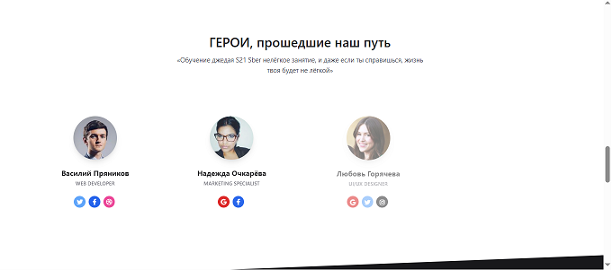

# animated-landing-page (анимированная посадочная страница)
Описание: 
Данный проект демонстрирует пример современного подхода к созданию адаптивных веб-интерфейсов с использованием популярных классов CSS-фреймворка TailwindCSS для стилизации элементов. Это позволяет быстро создавать гибкую и кроссбраузерную структуру, поддерживающую отзывчивость дизайна. 
Особенностью проекта является то, что в качестве исходного шаблона был взят один из 4-х предлогаемых TailwindCSS по умолчанию шаблонов - Landing Page (доступны также Dashboard Page, Login Page и Profile Page) в версии для JavaScript (доступны также версии React.JS, Vue.js, Angular). 
С помощью HTML Formatter HTML-код был форматирован таким образом, чтобы он стал более читаемым и структурированным. 
Был добавлен контент, изображения, иконки, ссылки на сторонние ресурсы, а также анимация с использованием Animate On Scroll Ligrary AOS. 
Выполнена следующая AOS анимация при скроллинге страницы: 
  - появление элементов с различных направлений (fade); 
  - масштабируемость (scale); 
  - временные задержки появления элементов (delay); 
  - перевороты (flip). 
Это позволило улучшить визуальный опыт пользователей, привлеч внимание к важным элементам и повысить общую эстетику дизайна сайта. 
Проект выполнен по концепциям CSS-in-HTML и JS-in-HTML. 
Посадочная страница мобильно адаптируема. 
**Анимация секции 1:** 
 
**Анимация секции 1:** 
 
**Анимация секции 1 завершена:** 
 
**Анимация секции 2:** 
 
**Анимация секции 2 завершена:** 
 
**Анимация секции 3:** 
 
**Анимация секции 3 завершена** 
 
**Анимация секции 4:** 
 
**Анимация секции 4 завершена** 
 
**Анимация секции 5:** 
 
**Анимация секции 5 завершена** 
 
**Анимация формы 6** 
 
**Footer** 
 